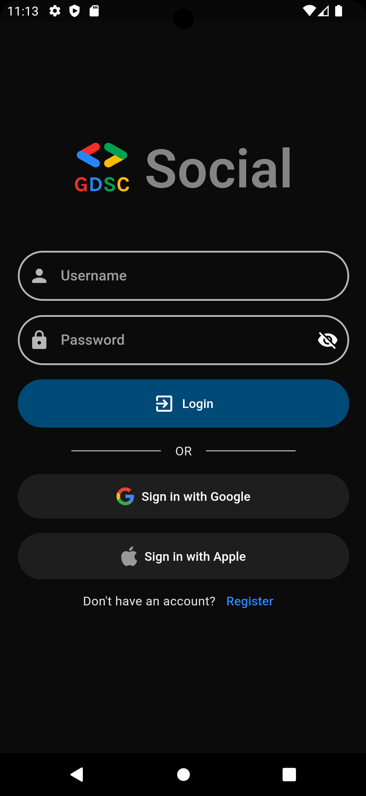
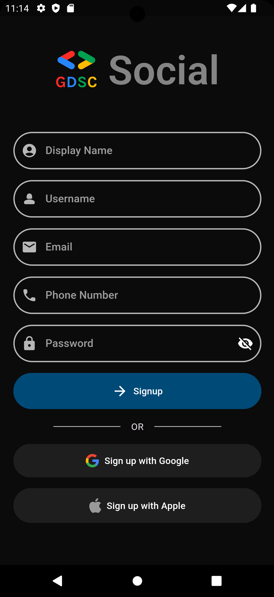
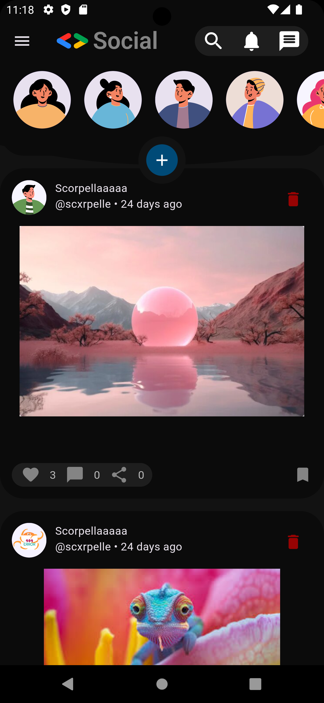
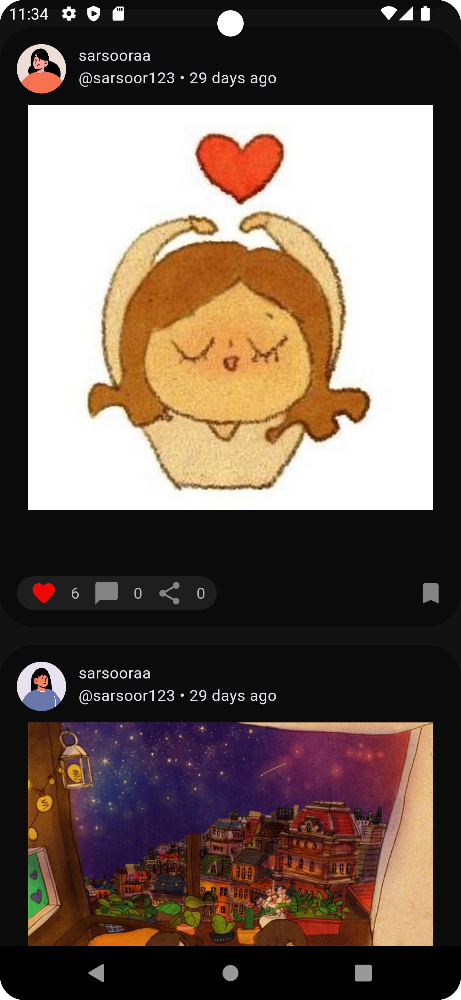
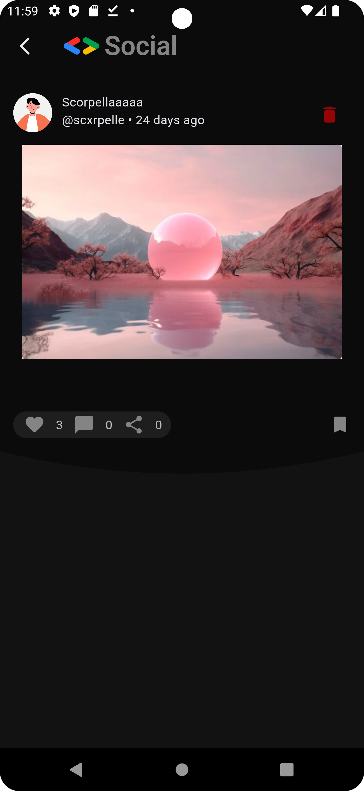
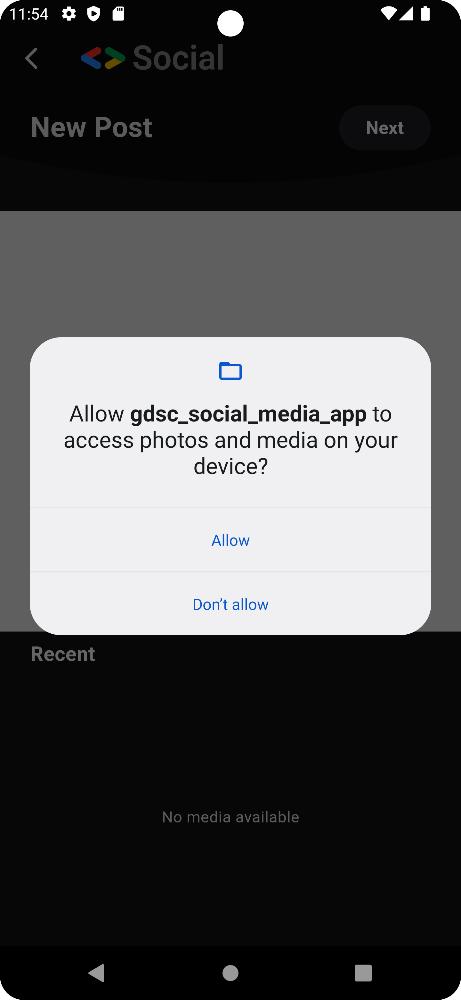
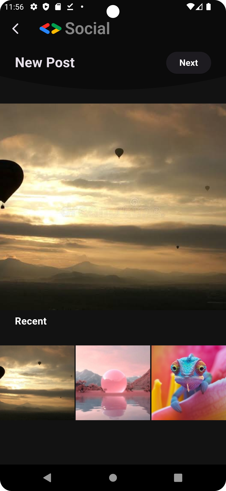
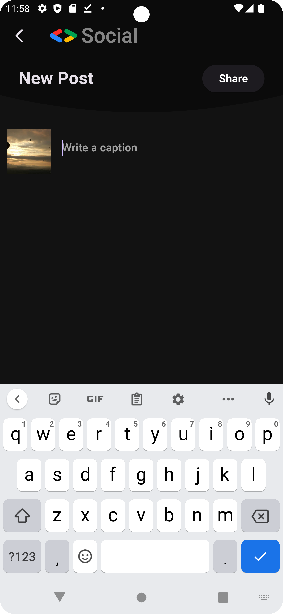
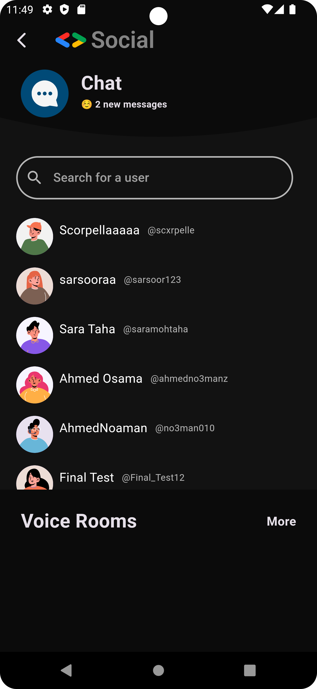
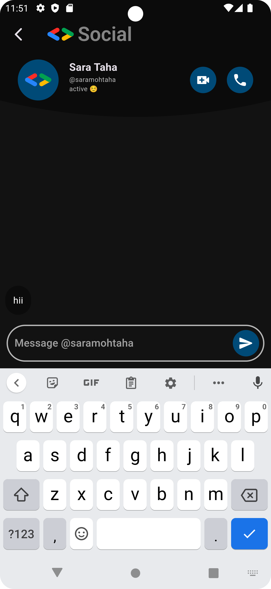

# GDSC Social Media App

A small social media application resembling Instagram.
## Installing Guide
To get started:
### Prerequisites
Ensure you have the following installed:
- Flutter SDK
- Git
- A Code Editor (e.g., VS Code, Android Studio)
### Steps to install
1. Clone the project

   ```git clone```
3. Install the required dependencies

   ```flutter pub get```
5. Run the project

   ```flutter run```

## Login/Signup Screens
You can create an account or log in to an existing one. This is implemented using Firebase Authentication

<p float="left">
  
  
</p>

## Home Screen
Here all the posts from people on the app will appear on your feed.
Users can like posts, delete only their posts if they no longer want it.

<p float="left">
  
  
</p>

You can click on the post to show if there are comments (still will be implemented)

<p float="left">
  
</p>

## Adding New Posts
Through the add button in the Home page, the user can post an image with the caption they want.
This is implemented using Firebase Storage for images, and with askin permission to access the users gallery.

<p float="left">
  
  
   
</p>

## Messages and Chatting
You can chat with the people you want. This is implemented using Firebase Realtime database

<p float="left">
  
  
</p>


